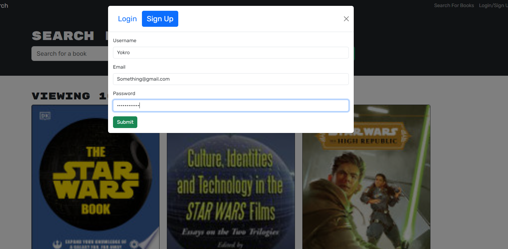

# Book-search-engine

## Description
- Search for your favorite books with this application! log in/signup to keep those books saved in your bookmarks for later use and even delete them from your bookmarks after you finished reading them or dont want them there anymore

## Installation
- git clone at https://www.github.com/Edesp1/book-search-engine or view the deployed app Here: https://guarded-tor-42089-399e77f4fd29.herokuapp.com
- First make sure you are in the right directory so please do cd server/ to get into the server directory of the application
- then please do npm i to install all the dependencies required to run this project
- finally follow that command up with npm start to start the application

## Usage
-once you load up the webpage you will see this

- you can then search for your favorite books using the search bar on the top of the page

- then if you want to save that book in your bookmarks please click on the login/signup button on the top right of the page

- once logged in click on save book and navigate to  see your books on the top of the page

## Collaborations
- Collaborations for this project are closed until further notice !

## License
- This project is under the MIT license

## Badges
